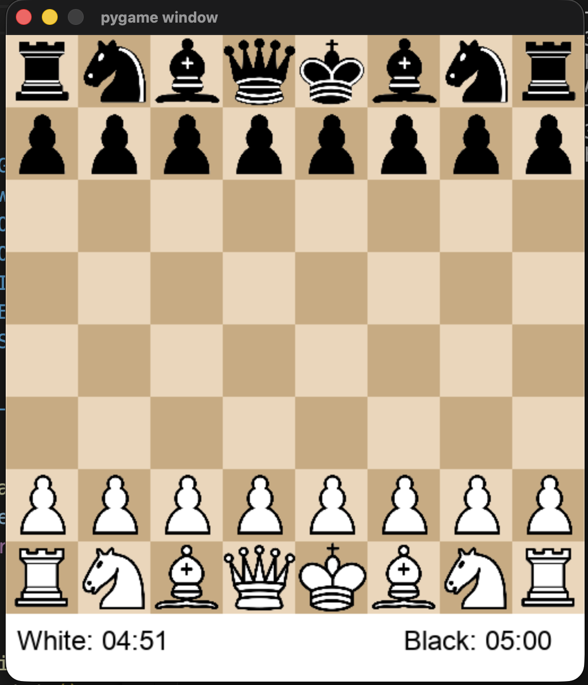
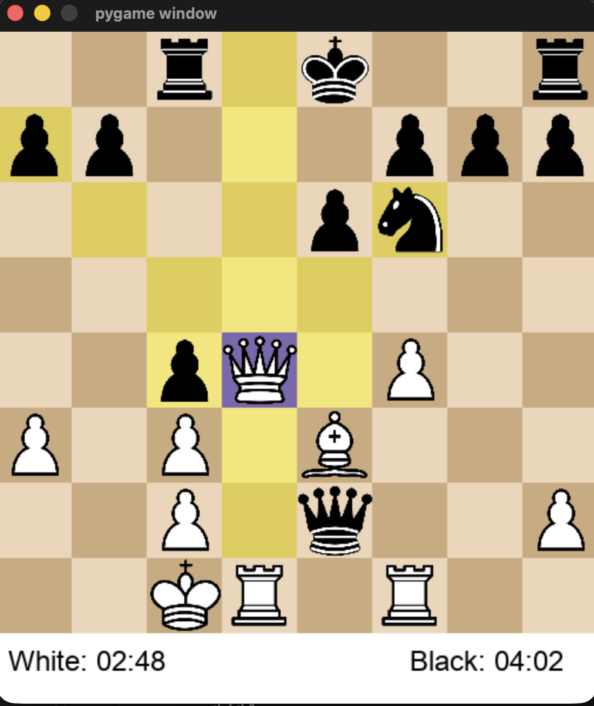
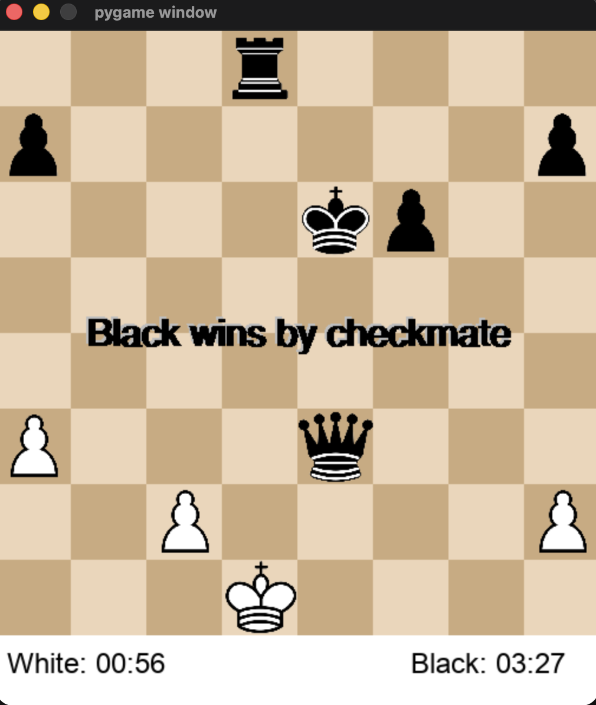

# CheckMate-X ♟️

CheckMate-X is a Python-based chess engine designed to simulate intelligent gameplay and assist users in practicing chess strategies. The system evaluates possible moves and selects optimal actions based on board state analysis.

## Features

- Intelligent move evaluation for competitive gameplay
- Simulates realistic chess matches
- Command-line based interaction
- Efficient board state representation
- Designed for learning and practicing chess strategies

## Screenshots

### Game Start

### Mid Game

### Checkmate Position

## Tech Stack

- Python
- Basic AI decision logic
- Data structures for board representation

## How It Works

1. The board is initialized using standard chess rules.
2. The engine evaluates legal moves from the current board state.
3. A decision algorithm selects the best move based on evaluation logic.
4. The board updates and gameplay continues until checkmate or draw.

## Installation

Clone the repository:

bash
git clone https://github.com/ashutosh691/CheckMate-X.git
cd CheckMate-X

Run the program:
python main.py

Example Gameplay
Player Move: e2 e4
Engine Move: c7 c5
Player Move: g1 f3
Engine Move: d7 d6

## Future Improvements

Implement Minimax algorithm with Alpha-Beta pruning

Add GUI interface

Improve board evaluation heuristics

Add multiplayer mode

## Author

Ashutosh Upreti

GitHub: https://github.com/ashutosh691

LinkedIn: https://www.linkedin.com/in/ashutosh-upreti-835540321/
